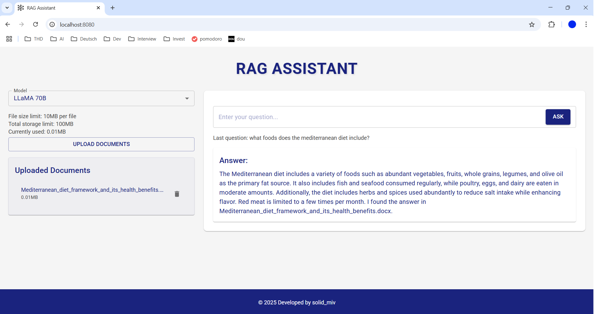
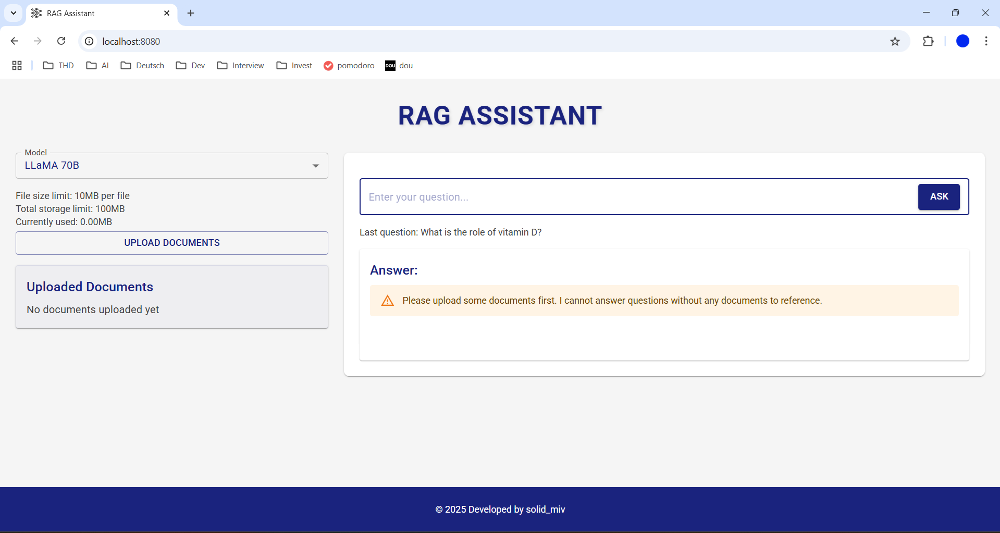
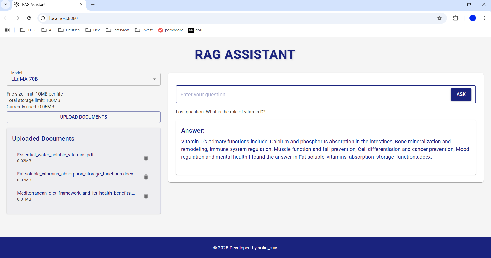

# RAG Assistant

A document-based question answering system that uses Retrieval-Augmented Generation (RAG) with various Large Language Models through `Groq API`.

## How to run
1. Navigate to the root directory of the project
2. Ensure Docker is installed on your system
3. Create an `.env` file in the `backend/` directory with your `Groq API` key (it's free):
```bash
GROQ_API_KEY=your_api_key
```
4. Build and start the docker container with the following command:
```bash
docker-compose up --build
```
5. Access the app via `http://localhost:8080` locally

## Technologies used
### Backend
- **Flask** - API endpoints
- **LlamaIndex** - RAG implementation and document processing
  - Vector store indexing
  - HuggingFace embeddings (`all-MiniLM-L6-v2`)
- **Groq API** - LLM provider with models:
  - `LLaMA 70B`
  - `Mixtral 8x7B`
  - `Gemma 9B`
- **Python Libraries**:
  - [`python-dotenv`](backend/requirements.txt) - Environment variable management
  - [`flask-cors`](backend/requirements.txt) - Cross-origin resource sharing
  - [`docx2txt`](backend/requirements.txt) - Document processing

### Frontend
- **React 19** - UI framework
- **Material UI 6** - Component library & theming
- **Vite** - Build tool and development server
- **Axios** - HTTP client for API requests

### Infrastructure
- **Docker** & **Docker Compose** - Containerization and Orchestration
  - Secure internal networking
  - Health checks
  - Volume management
- **Development Tools**:
  - Hot reload for frontend
  - Debug mode for backend
  - Environment variable protection

## Screenshots of the working App
**A normal answer of the system using `LLaMA` model**


**A warning that asks the user to upload the docs**


**An answer with several uploaded docs**
Note that the system explicitly states which document was used to get the answer

